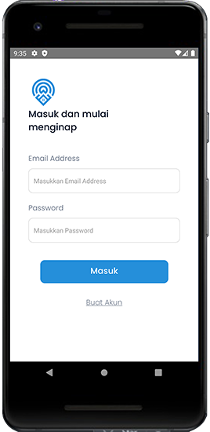
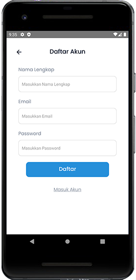

  <h1>Hotelio</h1>
  
<b>Final project 3 - Kelompok 1</b>

  
Aplikasi yang dibuat pada Final project ini adalah sebuah aplikasi mobile dengan menggunakan framework React Native. Aplikasi ini menggunakan API dari Rapaidapi dengan menerapkan sistem database  Local Storage.

 

---

## Panduan Aplikasi dari Sisi Pengguna (User Guide) 📒

Perlu diketahui sebelumnya bahwa di web app ini ada 2 macam role pengguna, yaitu:

Guest (pengguna yang belum login )
User (pengguna yang sudah login dengan role user)
---

### 1. Splashscreen

Halaman Splashcreen akan muncul pertama kali kita buka Aplikasi Hotelio

### 2. Intro Aplikasi

### 3. Sign In

### 4. Sign Up

### 3. Halaman Utama (Home) 🏠

Halaman ini bisa diakses

### 4. Halaman Favorit

Secara default halaman ini akan menampilkan semua daftar produk. Pengguna bisa filter produk berdasarkan kategori, atau urut berdasarkan property produk (Masi dalam tahap development).

### 5. Halaman Detail Produk (Detail Product) 📜

Halaman ini muncul ketika card produk diklik. Halaman ini berisi detail produk, dan juga terdapat tombol untuk menambahkan produk ke keranjang belanja. Pengguna dapat melihat melihat detail produk, dan menambahkan produk ke keranjang belanja dengan ketentuan harus login sebagai user terlebih dahulu.

### 4. Halaman/Modal Keranjang Belanja (Cart - User) 🛒

Halaman/Modal ini muncul ketika tombol keranjang belanja di navbar diklik pada role user. Halaman ini berisi daftar produk yang telah ditambahkan ke keranjang belanja. Pengguna dapat mengubah jumlah produk yang akan dibeli, menghapus produk dari keranjang belanja, dan melanjutkan ke halaman checkout.

### 5. Halaman Update Stock (Update Stock - Admin) 🗄️

Halaman ini muncul ketika tombol update stock di navbar diklik pada role admin. Halaman ini berisi daftar produk yang dapat diupdate stocknya. Pengguna dapat mengubah stock produk, dan menghapus produk dari daftar produk.

### 6. Halaman Sales Recap (Sales Recap - Admin) 📈

Halaman ini muncul ketika tombol sales recap di navbar diklik pada role admin. Halaman ini berisi daftar transaksi yang telah dilakukan oleh user. Pengguna dapat melihat total transaksi.

### 7. Halaman About Dev (About Dev) 👨‍💻

Halaman ini berada di footer web app. Halaman ini berisi informasi mengenai developer dan info secara singkat pada proses management pengembangan web.

- Note: _Kedepannya akan dilakukan pengembangan lebih lanjut terkait project web app ini. Terima kasih._

[Silahkan lihat panduan terkhusus bagi Reviewer dan Developer di link ini](./docs)
